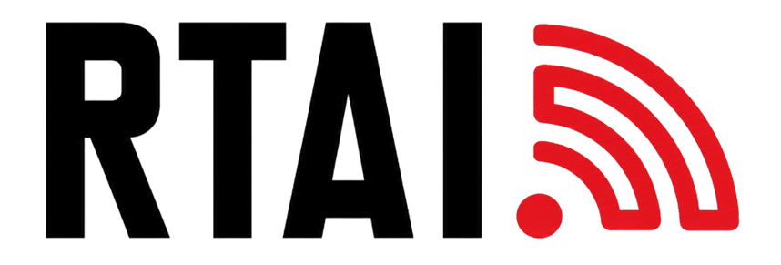
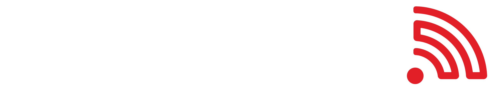

  
  &nbsp;&nbsp;&nbsp;&nbsp;&nbsp;&nbsp;&nbsp;&nbsp;&nbsp;&nbsp;
  

<h1 align="center">RadioTEDU</h1>

  <strong>An open-source, student-driven media laboratory at TED University dedicated to daily innovation and local AI.</strong>

  <a href="https://radiotedu.com">Website</a> •
  <a href="https://radiotedu.com/teknoloji/">Technology (Teknoloji)</a> •
  <a href="https://radiotedu.com/hakkimizda/">About Us (Hakkımızda)</a> •
  <a href="mailto:radio@tedu.edu.tr">Contact</a>

---

## 📻 About RadioTEDU

Located at **TED University**, RadioTEDU is an agile, student-led media laboratory. We believe that technology shouldn't just carry the broadcast—it should define the next generation of college radio. 

We are committed to **using and developing the most innovative technologies every single day**. Rather than relying on proprietary, closed-source broadcasting tools, our engineering and product teams design, build, and maintain our own digital ecosystem. 

A core pillar of our work is the integration of **local AI models** (rather than external cloud APIs) to ensure data privacy, low latency, and deep customizability. From local AI host automation to QR-enabled physical jukeboxes, we turn broadcasting into an active arena for software development, machine learning, and systems engineering.

---

## 🚀 Featured Projects

Here is a summary of the core projects driving the RadioTEDU ecosystem:

### 🎯 [Focus](https://github.com/radiotedu/focus)
*An ambient, distraction-free listening workspace.*
* **Overview**: Focus is a minimalist web-based interface built to accompany students during studying, writing, and creating.
* **Key Features**:
  * Dedicated thematic audio streams (Lo-Fi, Jazz, Classical).
  * Built-in Pomodoro timer to manage study blocks.
  * Customizable ambient sounds (nature, rain, background noise).
  * Ultra-clean, non-intrusive UI optimized for deep work.
* **Tech Focus**: Web Audio API, responsive design.

### 🎛️ [RadioTEDU Broadcasting Wall](https://github.com/radiotedu/wall)
*Our custom-built, open-source broadcasting core.*
* **Overview**: Wall is our proprietary alternative to commercial radio automation packages. It serves as the primary terminal for managing our entire live broadcast.
* **Key Features**:
  * Advanced playlist scheduling and automation.
  * Real-time metadata broadcasting (now playing details).
  * Live mixer and stream output management.
  * Integrations with custom local automation tools.
* **Tech Focus**: Audio streaming server integration, real-time web sockets.

### 🗳️ [votertai](https://github.com/radiotedu/votertai)
*Dynamic next-song voting system.*
* **Overview**: Votertai bridges the gap between the DJ and the audience, letting listeners actively vote on the queue.
* **Key Features**:
  * Live voting interface updated in real-time.
  * Dynamic queue adjustments based on voter preference.
  * Anti-spam and session-handling mechanisms for fair campus-wide voting.
* **Tech Focus**: Real-time state synchronization, API-driven playlist injection.

### 👾 [juke-local](https://github.com/radiotedu/juke-local)
*A modern, interactive campus jukebox.*
* **Overview**: A physical-to-digital bridge for shared university spaces. Juke-local allows students to scan a QR code and queue songs in campus lounges or common areas.
* **Key Features**:
  * QR-code based instant access—no app installation required.
  * Collaborative queue management for communal spaces.
  * Elegant, responsive web interface for requesting tracks.
* **Tech Focus**: Node.js/Python microservices, local network audio hosting.

### 🎫 [Bilet](https://github.com/radiotedu/bilet)
*Event ticketing and access control platform.*
* **Overview**: A bespoke ticketing solution tailored for university and campus events organized by RadioTEDU or student societies.
* **Key Features**:
  * Easy registration and booking flow.
  * Dynamic quota and capacity tracking.
  * QR-code scanning interface for rapid entry verification.
* **Tech Focus**: QR code generation/scanning, database-backed access management.

### 📱 [Mobile App](https://github.com/radiotedu/mobile)
*Bringing the broadcast into the daily lives of students.*
* **Overview**: Our companion mobile app provides a hub for live streaming, podcasts, and on-the-go interaction.
* **Key Features**:
  * Lightweight high-quality AAC+ audio player.
  * Access to on-demand podcasts and archived shows.
  * Roadmaps for Android Auto and Apple CarPlay support to bring RadioTEDU to commuting students.
* **Tech Focus**: Cross-platform mobile development (React Native/Flutter), CarPlay/Android Auto API.

---

## 🛠️ Tech Stack & Innovation

We leverage cutting-edge technologies to keep our platform efficient, robust, and autonomous:

* **Local Artificial Intelligence**: We run and fine-tune open-source Large Language Models (LLMs) **locally on our own hardware** to act as an automated **AI Host**, generating smooth transitions, track introductions, and news updates without relying on external cloud APIs.
* **Audio Streaming**: High-efficiency formats like **AAC+ / HE-AAC** to deliver crystal-clear audio even under limited bandwidth conditions.
* **Frontend & Mobile**: Modern web technologies and cross-platform mobile frameworks for seamless, responsive experiences across devices.
* **Infrastructure**: Self-hosted microservices and open-source integrations tailored to campus-scale operations, allowing us to push new experimental features daily.

---

## 📫 Get in Touch

* **Website**: [radiotedu.com](https://radiotedu.com)
* **General Inquiries**: [radio@tedu.edu.tr](mailto:radio@tedu.edu.tr)
* **Follow Us**: [Instagram](https://www.instagram.com/radiotedu/) | [LinkedIn](https://www.linkedin.com/company/radiotedu/) | [YouTube](https://www.youtube.com/@RadioTEDU) | [Spotify](https://open.spotify.com/user/31qub2lbtxckv7cjzuxgcv7qes4a)
